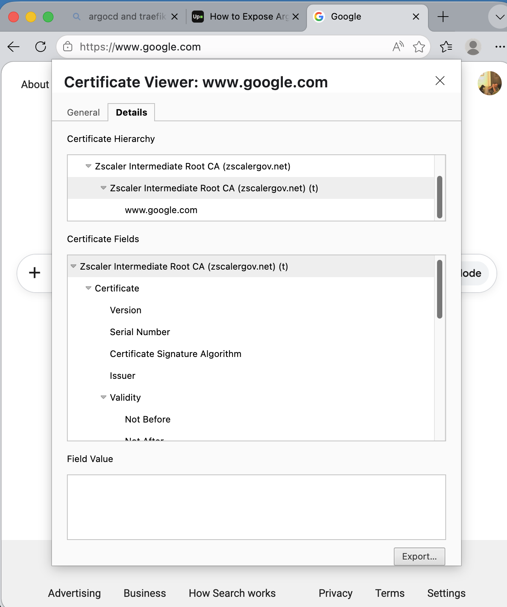
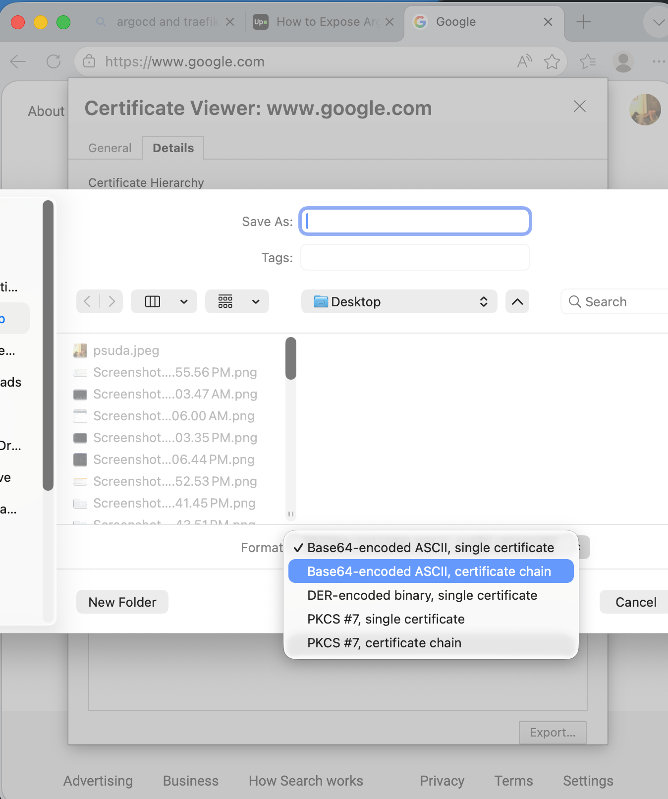

# SSL Inspection Workaround
Booz Allen Hamillton (BAH) uses Zscaler CA as part of an SSL inspection security. However, it can cause a few issues. 

Common symptoms:

- x509: certificate signed by unknown authority

- Image pull failures in Kubernetes (e.g., ErrImagePull, ImagePullBackOff)

- Pods stuck in Init or failing to start due to registry access issues

The following provides a rough instructions on getting around this issue:

If on BAH laptop, (examples are using the MS Edge browser) go to https://www.google.com "right-click" on the URL security icon and view the certificate. Selecting the last Zscaler in the chain, then make sure to export the entire public CA chain.  

Export the certificate chain to a PEM file, using Base 64, ASCII certificate chain format. 

Save the file for example to the project folder: ./cert/Zscaler-bundle.pem 
```bash
# local env files

.env.local
.env.development.local
.env.test.local
.env.production.local
# certificates
cert/
```

In the Dockerfile, the easiest way to add in the bundled certificates is using the environment variable NODE_EXTRA_CA_CERTS. Note: "update-ca-certificates" may not handle the bundled chain.  There is an option to skip the SSL verification, using "RUN npm set strict-ssl false" command. However, the secure way is to apply the certificate chain.  

This change will trust the Zscaler CA certificate chain. below is an example of adding to  the 'base' Docker file build section. Your Dockerfile may be different. Ensure to include the certificates before pulling any remote sources.  
```bash
ARG NODE_VERSION=22.11.0
ARG PNPM_VERSION=10.30.2

FROM node:${NODE_VERSION}-alpine AS base

# Set working directory for all build stages.
WORKDIR /app
# can skip adding certificate
# RUN npm set strict-ssl false
# Below will add the extra certificate chain in the docker file
COPY ./cert/Zscaler-bundle.pem /usr/local/share/ca-certificates/Zscaler-bundle.crt  
ENV NODE_EXTRA_CA_CERTS=/usr/local/share/ca-certificates/Zscaler-bundle.crt
# must be set before installing remote sources
# Install pnpm.
RUN --mount=type=cache,target=/root/.npm \
    npm install -g pnpm@${PNPM_VERSION}
```
 